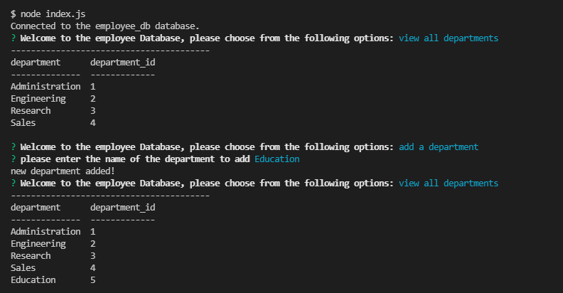
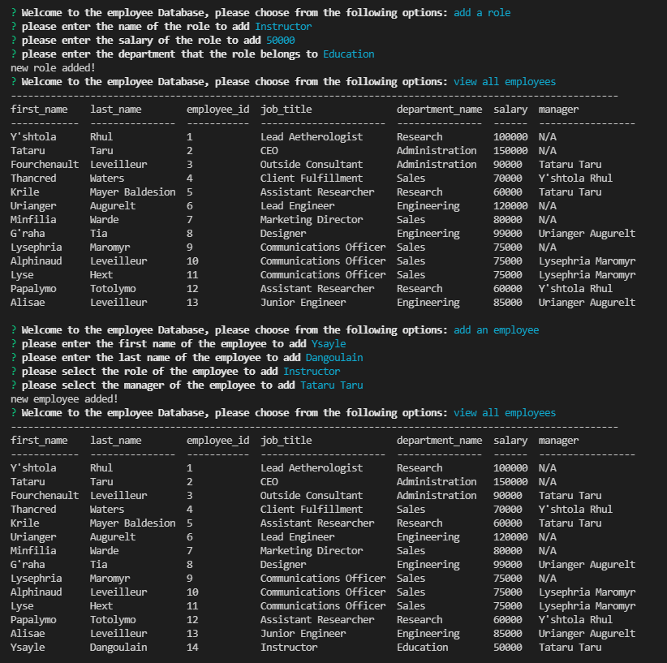
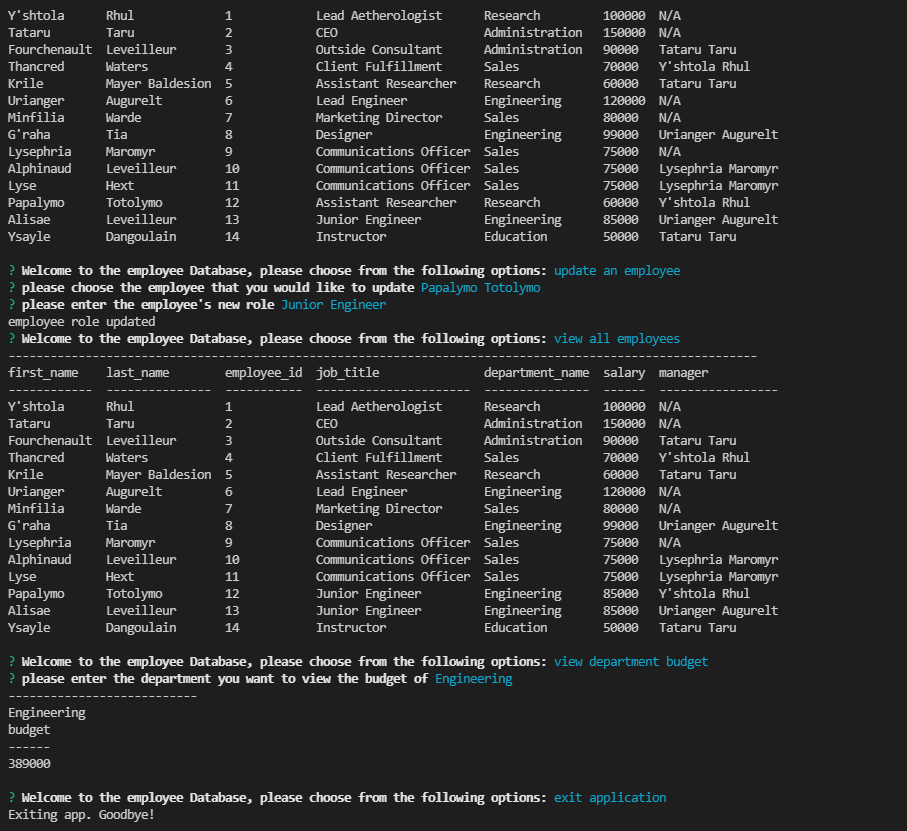

# Employee Tracker

This is a command-line application that allows the user to interact with an employee database in a number of ways. The user can view all departments, roles and employees. The user can also add a department, role or employee and the database will update in real time. The user can even update an employee role or see the budget of a department (combined total of all salaries in that department).

## Getting Started

* First, make sure you have a terminal viewer installed (such as Git Bash).
* Next, install [Node.js](https://nodejs.org/).
* Then, install [MySQL](https://www.mysql.com/) and follow their instructions VERY carefully.
* Open up your terminal and navigate to the db folder.
* type in `mysql -u root -p`
* Enter the password as `password`
* Run `source schema.sql` in the command line
* Run `seeds.sql` in the command line (note: you can make your own seeds.sql file if you prefer!)
* Open a NEW terminal and navigate to the root folder
* Run `npm install` and wait for node_modules to finish installing
* Finally, run `node index.js` to start the app!

## Deployed Link

* N/A (see Getting Started section)

## Demo

* [Link to video Demo](https://watch.screencastify.com/v/ht1WXr7T4OXikg5RoEJJ)

## Screenshots

## Built With

* [Javascript](https://developer.mozilla.org/en-US/docs/Web/JavaScript)
* [Node.js](https://nodejs.org/)
* [Inquirer package](https://www.npmjs.com/package/inquirer)
* [MySQL2 package](https://www.npmjs.com/package/mysql2)
* [console.table package](https://www.npmjs.com/package/console.table)

## Authors

* **Emily Dorgan** 

- [Link to Portfolio Site](https://emdorgan.github.io/updated-portfolio/)
- [Link to Github](https://github.com/emdorgan)
- [Link to LinkedIn](https://www.linkedin.com/in/emily-dorgan/)

## License

This project is licensed under the [MIT License](https://opensource.org/licenses/MIT)